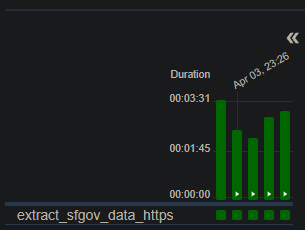
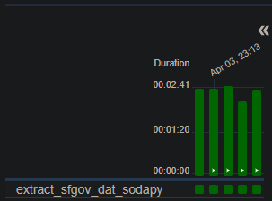

# Data Architecture: Bronze, Silver, and Gold Layers

## Explanation
The **Bronze, Silver, and Gold** layers are used in data architecture to organize and transform information:

- **Bronze** 🟤 → Raw data, ingested directly from source systems, without processing.
- **Silver** ⚪ → Cleaned and transformed data, prepared for deeper analysis.
- **Gold** 🟡 → Highly refined and aggregated data, optimized for BI and reporting.

### Summary
**Bronze (raw) → Silver (processed) → Gold (ready for use).**
## Why This Method?
I chose this method because the **Bronze, Silver, and Gold** layers ensure an organized data flow, making auditing and traceability easier.

# How I did it and how I thought
1: Montei o hambiente com Docker e Airflow.

2: Estudei os documentos da api e vi que tem dois metodos de extração, https e soday(Lib python)

3: Montei dois processe de extração do dados um com cada metodo para ver qual era melhor.

